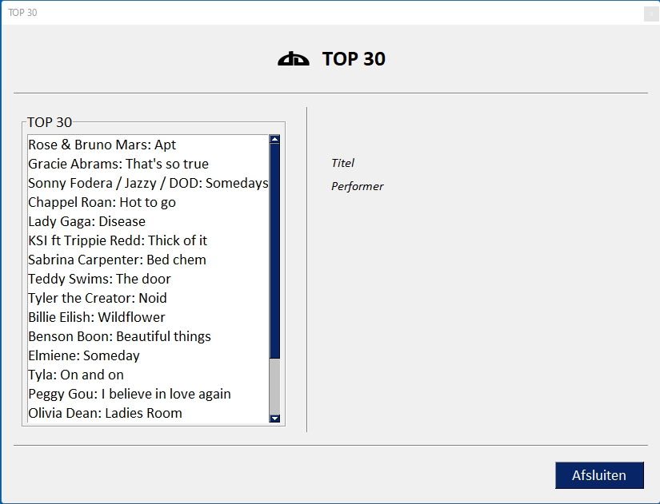
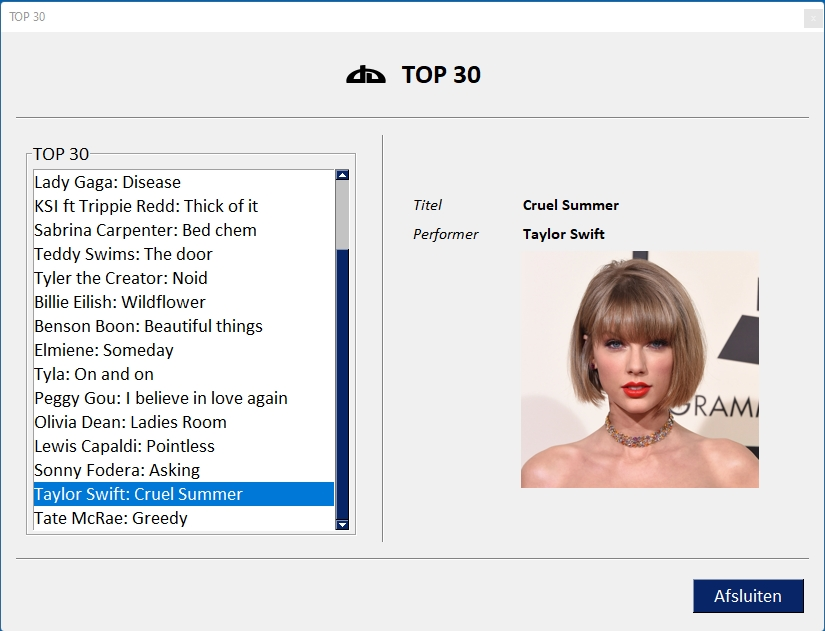
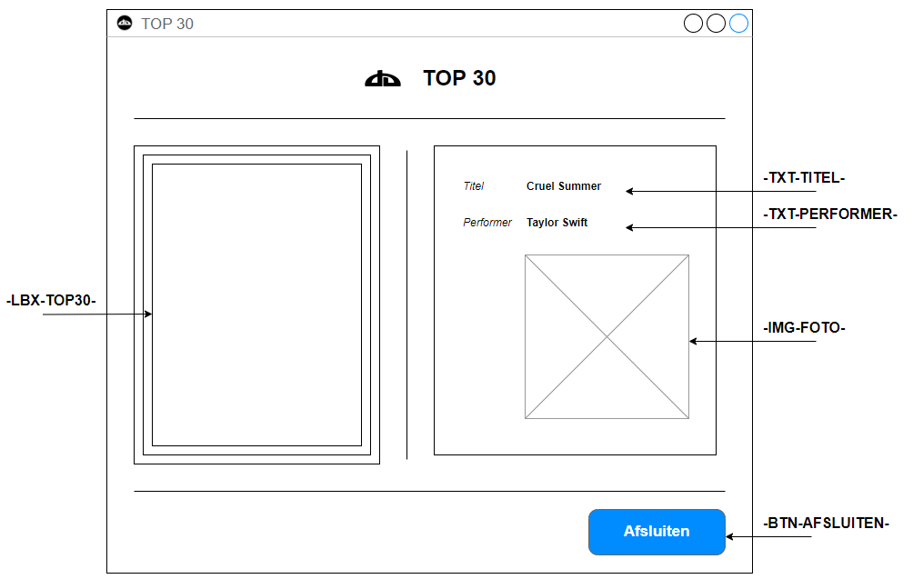
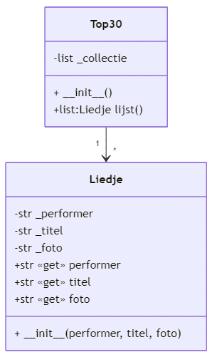

# Oefening 07

In dit project ligt de nadruk op entiteitklassen.  De gegevens bij dit project krijg je in de vorm van een JSON-bestand.

## Opdracht

Je maakt een kleine applicatie met grafische gebruikersinterface die een lijst toont met de liedjes uit de 'TOP 30' toont.



Wanneer de gebruiker op een liedje in de lijst klikt, dan krijg je de detailinformatie over het betreffende liedje.  Je krijgt de titel van het liedje, de naam van de performer of groep en een foto van de performer.



De gegevens voor dit project krijg je in de vorm van een JSON-bestand.  Bij het starten van het project wordt het JSON-bestand uitgelezen en van elk liedje wordt een object (instantie van een klasse) gemaakt.  Deze objecten worden in de listbox weergegeven.

Wanneer de gebruiker op een item in de listbox klikt, dan wordt van het corresponderende object de titel, naam performer en bestandsnaam foto opgehaald en weergegeven.

## Projectstructuur

Je structureert het project als volgt

```bash
│   main.py
│
├───app
│       app.py
│       app_layout.py
│
├───assets
│       favicon.ico
│       logo.png
│
├───bin
│       imagetkhelper.py
│
├───data
│   │   top30.json
│   │
│   └───afbeeldingen
│           51080002821ea5f41dea6512f840c9c6.jpg
│           Benson-Boone_Better-Alone-scaled-1-e1662948136739.jpeg
│           billie_eilish.jpg
│           Chappell-Roan-2018.jpg
│           elmiene-e1679766006315.jpg
│           gracie_abrams.jpg
│           ksi.png
│           lady_gaga.jpg
│           lewis-capaldi-1.jpg
│           Olivia-Dean.jpg
│           rose-bruno-2.jpg
│           sabrina-carpenter-2018-tiff-portraits-14.jpg
│           sonny fodera.jpg
│           sonnyfodera_press_shot.jpg
│           tate-mcrae-1.jpg
│           taylor-beauty14.jpg
│           Teddy-Swims-602.jpg
│           Tyla.jpg
│           tyler.jpg
│
└───entiteit
        liedje.py
        top30.py
```

De structuur van het project is grotendeels de projectstructuur die we tot hiertoe gebruikten in voorgaande oefeningen en evaluaties.  We beperken ons tot de elementen die hiervan afwijken:

* **data**  
  De map 'data' bevat alle gegevens met betrekking tot de 'TOP 30'.  We onderscheiden:
  
  * **top30.json**  
    Een JSON-bestand met alle liedjes van de TOP 30.  De node 'top30' bevat een lijst met voor elk liedje een element met 'performer', 'titel' en 'foto'.  
    
    ```json
    {
    "top30": [
        {
            "performer": "Rose & Bruno Mars",
            "titel": "Apt",
            "foto": "rose-bruno-2.jpg"
        },
        ...
        ]
    }
    ```
  
  * **afbeeldingen**  
    Een map met de foto's van de betreffende performers

* **entiteit**  
  Deze map bevat de container- en entiteitklasse
  
  * **liedje.py**  
    De entiteitklasse 'Liedje' representeert één enkel liedje (titel, performer en bestandsnaam foto)
  * **top30.py**  
    De klasse 'Top30' is een containerklasse en beheert alle instanties van de klasse 'Liedje'.  
    In de grafische gebruikersinterface wordt van een instantie van deze klasse gebruik gemaakt om de lijst met liedjes op te halen.

## Grafische gebruikersinterface

Hieronder, een afbeelding van de grafische gebruikersinterface met de key-elementen.



Het middelste dele van de grafische gebuikersinterface bestaat uit twee kolommen, door een 'VerticalSeparator' met horizontale padding 15 van elkaar gescheiden:

* **linker kolom**  
  Voor de linker kolom maken we gebruik van een 'Column'-element waaraan we een  'Frame'-element met titel 'TOP 30' toekennen.  Aan de layout van dit 'Frame'-element kennen we een 'Listbox' grootte 30x15.    
  De lijst met de liedjes van de TOP 30 wordt in deze 'Listbox' weergegeven.  
  Klikt de gebruiker op een item in de 'Listbox' dan wordt een 'event' getriggerd.  Maak hiertoe gebruik van de eigenschap 'enable_events'.  Door aan de eigenschap 'select_mode' LISTBOX_SELECT_MODE_SINGLE toe te kennen, zorg je ervoor dat slechts één item tegelijk uit de lijst geselecteerd kan worden.

* **rechter kolom**   
  De rechter kolom bestaat op één 'Image'-element na uit 'Text'-elementen.  Ken aan de 'Text'-elementen voor de labels de grootte 12x1 toe.

## Entiteitklassen

Voor dit project maak je gebruik van twee entiteitklassen:

* klasse **Liedje**:  
  De klasse 'Liedje' is verantwoordelijk voor één enkel liedje en beheert alle gegevens met betrekking tot dit liedje.  
  De klasse maakt gebruik van volgende eigenschappen:   
  * `_performer`  
    string met de naam van de uitvoerende artiest of groep
  * `_titel`  
    string met de titel van het liedje
  * `_foto`  
    str met de bestandsnaam van de foto die bij dit liedje hoort
  
  De eigenschappen worden gezet bij het instantiëren van de klasse.
  Verder ken je aan de klasse volgende methoden toe:
  
  * `__init__()`  
    Constructor, wordt gebruikt om de eigenschappen `_performer`, `_titel` en `_foto` te zetten
  
  * `performer()`  
    Deze methode levert de inhoud van de eigenschap `_perfomer`.  
    De methode wordt aangeroepen als eigenschap (property)
  
  * `titel()`  
    Levert de inhoud van de eigenschap `_titel`.  
    Ook deze methode wordt aangeroepen als eigenschap (property).
  
  * `foto()`  
    Levert de inhoud van de eigenschap `_foto`.  
    Deze methode wordt aangeroepen als eigenschap (property)
  
  * `__str__()`  
    Levert een tekst representatie van de klasse: performer en titel liedje
    Deze methode wordt aangeroepen wanneer wanneer de liedjes in de Listbox worden opgesomd
  
  * `__repr__()`  
    Deze methode levert een string met de representatie van het betreffende object, de instantie van de klasse
* De klasse **Top30**  
  Deze klasse is verantwoordelijk voor het uitlezen van het gegevensbestand (JSON-bestand) en het beheren van de liedjes-objecten.  
  De klasse kent slechts één enkele eigenschap:
  * `_collectie`  
    een list met objecten, de instanties van de klasse 'Liedje'
  
  Verder onderscheiden we volgende methoden:
  
  * `__init__()`  
    Constructor, staat in voor het initiëren van de eigenschap `_collectie`.  
    Verder staat de constructor in voor het uitlezen van het gegevensbestand 'top30.json' uit de map 'data'.  
    Van elke liedje in dit gegevensbestand wordt een instantie van de klasse 'Liedje' gemaakt en aan de eigenschap `_collectie` toegevoegd.
  
  * `lijst()`  
    Deze methode levert de inhoud van de eigenschap `_collectie` op, nodig voor de weergave van de liedjes in de Listbox.

De klassendiagram met cardinaliteit van beide klassen staat hieronder afgebeeld.



Becommentarieer beide klassen en maak van beide klassen een klassendiagram.  
Ken enkel aan de klasse 'Liedje' een doctest toe.
